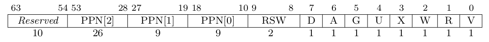

-  sv39 页表组成以及作用
    
    如图，低8位为状态位，其中：
    V表示是否valid， R表示是否可读，W表示是否可写，X表示是否可执行，G在x86上一般表示粒度(页面大小4k,2M...)，这里不是很清楚，A表示是否被访问过，D表示当前页与内存中不一致。
    
    中间两位为保留位，一般留给内核使用。

    后续 44 位为物理页号，总共可以表示 2^14 个物理页。

- 缺页
  - 缺页异常一般由 *非法访问（野指针），内存被swap到 物理内存中以及页表填写错误* 引起。
  - lazy策略可以加速内存分配速度，减少物理内存使用，实现 cow 等特性。
  - 一个三级页表可以表示 2M 的物理内存，自身需要4k的内存，由此可得 10G/2M * 4K = 20M 的物理内存。第一级和第二级占用相对较少，可以忽略。即大致需要20M的物理内存。
  - 当 app 通过 mmap 或者 brk 等系统调用申请内存时，可以先将对应的pte创出，将权限填为用户申请的权限，唯独valid和 ppn 都为0。 这样，当用户实际访问这块内存的时候，就会触发缺页异常，此时进行实际ppn的分配。
  - 应当是pte存在，但其中valid位为0。

  - 单双页表
    - 单页表只需要在进程切换时进行切换，因为此时内核可以视为是app的一部分。
    - 通过pte的U位，内核映射的页面U位为0，只允许内核使用。
    - 简单，无需额外设置trap_ctx以及跳板，且页表内存占用比双页表小。 
    - 从用户态到内核态或者反之都需要进行页表切换。单页表可以在进程切换时进行替换。
